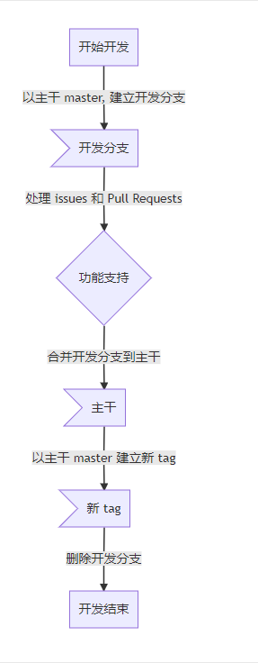
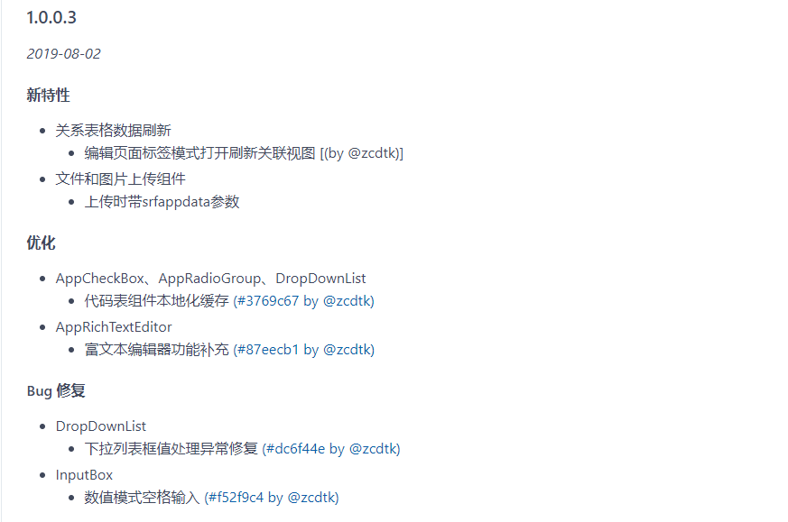
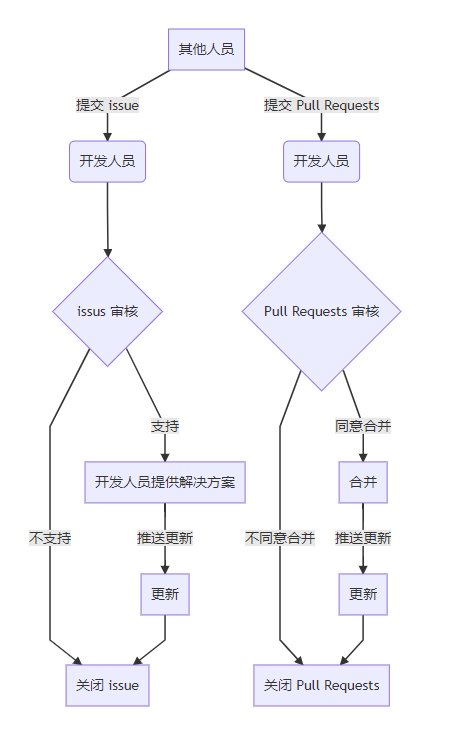

# iBiz 模板开发与维护简介

本文节主要基于 Issues 管理、Pull Requests 管理、更新管理和执行流程等四个方面介绍前端模板维护。

建议阅读文档：

- [《提问的智慧》](https://github.com/ryanhanwu/How-To-Ask-Questions-The-Smart-Way)
- [《如何向开源社区提问题》](https://github.com/seajs/seajs/issues/545)
- [《如何有效地报告 Bug》](http://www.chiark.greenend.org.uk/%7Esgtatham/bugs-cn.html)
- [《如何向开源项目提交无法解答的问题》](https://zhuanlan.zhihu.com/p/25795393)

##  Issues 管理

Issues 是开源软件用于讨论的一个问题列表，人们可以在 issues 中提出任意问题。例如，讨论技术方向、新的需求说明和软件 bug 修复等，软件开发维护人员会从中选取一些有价值的问题，提供一定的解决方案，作为开源软件常规维护。同时，开发人员同时会提出一些软件发展方向给人们讨论，在其中获取一些有价值的建议。

### Issue 规范

Issue 一般常用于新功能需求说明和软件 bug，本小节就针对这两个部分做一个提交 issue 的建议标准。

新功能需求，一般以描述为主，也可以添加相应的图片示例。新功能需求需要描述使用场景、解决问题和数据来源等问题，方便开发人员了解是否需要集成该功能。

软件 bug 的提出可以遵循以下步骤：

```
What steps will reproduce the problem? 
该问题的重现步骤是什么？
1. 
2. 
3. 

What is the expected output? What do you see instead? 
你期待的结果是什么？实际看到的又是什么？

What version of the product are you using? On what operating system? 
你正在使用产品的哪个版本？在什么操作系统上？

Please provide any additional information below.
如果有的话，请在下面提供更多信息。
```

> 注：该步骤是  Google Code 社区 问题模板，建议使用该步骤提交问题。

### Issue 审核

Issues 内不是所有 issue 都有响应的必要，一些问题经过讨论，没有支持的需要，一般会被关闭。其他需要软件支持部分，会通过开发人员审核，确定其属于新功能需求和 bug 修复中的哪一类，将问题分配开发维护人员支持。

> 注：通过开发与维护人员提供解决的 issue，建议将更新日志同步到更新管理中。

#### 新功能需求

进入新功需求的 issue，会将该需求集成到模板中，作为预置功能，提供所有人员使用。

一般而言，统一性新功能支持周期较长，它需要考虑对已有模板的兼容程度，已经相应的工作量安排。同时，还需要考虑，是否需要更高层级的 iBiz 模型支持。

新功能需求代码测试提交合并后，该 issue 会被关闭。

#### bug 修复

软件 bug 修复，软件开发与维护里面最常见的一类 issue，开发与测试人员接收该问题后，还原该 bug，找到解决方案、测试和提交等一系列过程，都属于 bug 修复的执行流程。

bug 修复代码测试提交合并后，该 issue 会被关闭。

## Pull Requests 管理

对软件的方案的解决，除了一般性的在 issues 中提出 issue，交由软件开发人员做支持之外，还可以直接在软件中建立解决方案的合并请求，开发人员审核该合并请求是否被允许合并。

Pull Requests 的好处在于，提交合并请求的人员，已经直接提供了一个合理解决方案，它将大大减少软件开发维护人员的工作量，同时，产生良好的技术参与氛围。

## 更新管理

在更新管理部分，可划分为新版本推送、更新日志说明和邮件通知三部分。

### 新版本推送

#### 固化新版本

开发与维护人员在开发过程中，会以主干 master，构建一个新的版本出来，该版本会支持当期需要支持的功能。

支持的功能包括常规的 bug 修复、新功能需求以及其他人员请求合并内容，功能支持到一定程度后，该开发版本会被合并到主干 master 中，再由 master 固话一个新的 tag，删除开发版本，即完成一次开发和版本固话的过程。

> 注：每个 tag，即为一个版本。

固化新版本流程如下：



#### 更新日志说明

每次 bug 修复完成后，需要在基础文件、模板文件的 README.MD 书写更新日志，内容结构如下所示：

- 版本号：
- 修复日期
- 修复类型
- 非兼容性更新：破坏性更新，更新的内容不兼容老版本
  - 标题：简述问题名称
  - 内容：该问题详情，此处需要注意，内容描述里面需要包含提交记录链接（6位随机码），修复人等详细内容
- 优化：主要是对之前的代码做了调整，重构
  - 标题：简述问题名称
  - 内容：该问题详情，此处需要注意，内容描述里面需要包含提交记录链接（6位随机码），修复人等详细内容
- bug 修复：主要是对出现的bug进行修复
  - 标题：简述问题名称
  - 内容：该问题详情，此处需要注意，内容描述里面需要包含提交记录链接（6位随机码），修复人等详细内容
- 新特性：添加新功能
  - 标题：简述问题名称
  - 内容：该问题详情，此处需要注意，内容描述里面需要包含提交记录链接（6位随机码），修复人等详细内容


详情示例见图：



### 邮件通知

预生产环境于每周三更新，生产环境于每周周六更新。预生产环境更新之后，需要将本周更新内容通过邮件发送至更新人员邮箱，最后更新人员更新到生产环境后，推送各个使用方，流程见下图：


## 执行流程

iBiz 模板开发与维护流程如下：



